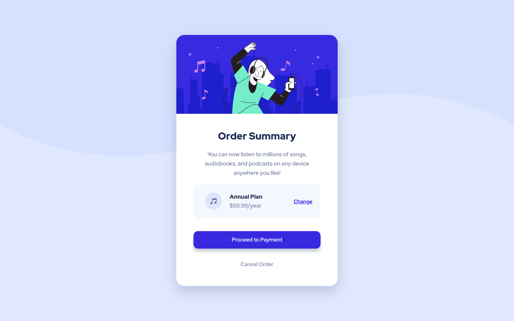

# Frontend Mentor - Order summary card

## Welcome! 👋

This is a solution of **Order summary card challenge on Frontend Mentor**.
I am still aiming to complete one challenge a day.
In this case, try to keep the widths( *1440px* and *375px* ) as close as possible.
I used **HTML** and **CSS**

## Screenshots 🤨📷

### 1440px - Desktop

## 375px - Mobile

